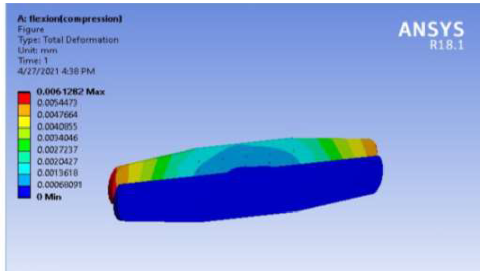
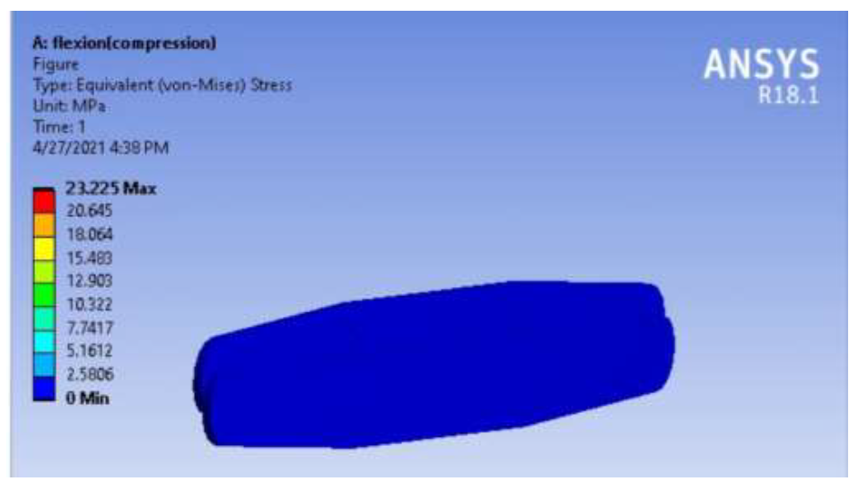

## A repository which contains the part and the assembly files for the prototype of the _Height adjustable soft Cervical Collar_

:warning: These part and assembly files are compatible only with the latest version of Solidworks - `SOLIDWORKS 2021` 

## Introduction
Cervical collar, also known as a neck brace, is a medical device used to support a
person’s neck who have had traumatic head or neck injuries. Collars generally come in two
categories (Hard and Soft collars). The Hard type is typically used for severe neck pain, spinal
fractures and other injuries whereas soft type is often used for moderate neck pain.
Hard and Soft collars are available in standard sizes (by size,we mean distance between
edge of sternum and lower jaw). Hard collars have a provision to adjust their size according to
the patient’s need whereas soft collars are available in only predefined sizes. So we propose a
method to bring about a height adjustment mechanism in soft collars and this project also
proposes the use of Shape Memory Foams (SFM) to provide necessary cushioning to the
sternum.

## Design Results

 <em> The proposed designed of the cervical collar with shape memory foam </em> 
  
 
 

## Analysis Results

* **Collar under Flexural Loading**

 <em> Total Deformation under flexion loading </em> 
 
  
 
 
 
 

  <em>Von Mises Stress under flexion loading </em> 
 
 
 
 
 * **Collar under Shear loading**
 

  <em>Total Deformation under shear loading </em> 
 
  
  

  

  <em>Von Mises Stress under shear loading </em> 
 
 

